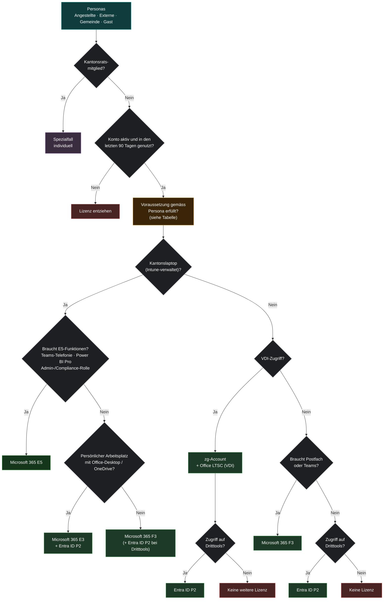

# Lizenzmatrix v2 – Vorschlag

**Ziel:** Weniger Microsoft-365-E5-Lizenzen. E5 nur noch für Personen, die E5-Funktionen
wirklich brauchen. Wer nur Zugriff auf Dritttools braucht, bekommt Entra ID P2.

---

## 1. Was ist an der heutigen Matrix das Problem?

| # | Problem in v1 | Folge |
|---|---|---|
| 1 | **Angestellte bekommen immer E5**, ohne Prüfung | Auch Personen ohne Kantonslaptop oder mit wenig Nutzung (Werkhof, Teilzeit, Aushilfen) belegen eine E5-Lizenz. |
| 2 | **„Kantonslaptop = Ja“ führt bei Externen, Gemeinde und Gästen direkt zu E5** | Projektmitarbeitende und Externe bekommen die teuerste Lizenz, nur weil sie ein Gerät haben. |
| 3 | **Keine Regel zum Entziehen** | Inaktive, deaktivierte oder ausgetretene Konten behalten E5. |
| 4 | **Vier verschiedene Bäume** für eigentlich dieselbe Frage | Schwer zu pflegen, schwer zu automatisieren. |
| 5 | **Doppellizenzen werden nicht verhindert** | E5 enthält schon Entra ID P1/P2, EMS und Power BI Pro. Werden diese zusätzlich zugewiesen, zahlt man doppelt. |

---

## 2. Wichtig zu wissen, bevor ihr umstellt

**Entra ID P2 ersetzt E5 nicht 1:1.** P2 lizenziert nur die *Identität* (Anmeldung,
Conditional Access, Identity Protection, PIM, Zugriff auf Enterprise Applications /
Dritttools). P2 enthält **nicht**:

- Exchange-Postfach, Teams, OneDrive, SharePoint
- Office-Apps (Word, Excel, Outlook …)
- Intune, Windows Enterprise, Defender for Endpoint

**Folge für Kantonslaptops:** Wer einen Intune-verwalteten Kantonslaptop hat, braucht mindestens
eine Lizenz mit Intune und Windows Enterprise, also **E5, E3 oder F3** (oder EMS E3 + Windows E3).
**P2 allein reicht dafür nicht.**

Das grösste Sparpotenzial liegt deshalb hier:

1. **Personen ohne Kantonslaptop**: hier ist P2 (ggf. mit Office LTSC auf der VDI) richtig.
2. **Inaktive und deaktivierte Konten**: Lizenz ganz entfernen.
3. **Doppellizenzen**: P1/P2/EMS/Power BI Pro bei E5-Benutzern entfernen.
4. **Laptop-Benutzer ohne E5-Bedarf**: auf **M365 E3 + Entra ID P2** (oder F3) umstellen,
   *falls E3/F3 in eurem Vertrag verfügbar ist*. Falls nicht, bleiben diese bei E5, bis der
   Vertrag angepasst ist.

> ⚠️ **Achtung beim Entziehen von E5:** Mit der E5-Lizenz verschwinden auch die Lizenzen für das Postfach
> und OneDrive. Postfach-Inhalte werden nach 30 Tagen gelöscht, OneDrive nach Ablauf der Aufbewahrungsfrist.
> Vor dem Umstellen also prüfen, ob die Daten noch gebraucht werden (Postfach ggf. in ein freigegebenes
> Postfach umwandeln, Litigation Hold / Aufbewahrungsrichtlinien beachten).

---

## 3. Neue Matrix – eine Logik für alle Personas


Statt vier Bäumen gibt es **einen Entscheidungsbaum**. Die Persona entscheidet nur noch
über die **Voraussetzungen** (Abschnitt 4), nicht mehr über die Lizenz.



> Wenn E3/F3 im Vertrag **nicht** verfügbar sind: die Kästchen „E3 + P2“ und „F3“ vorerst durch
> „Microsoft 365 E5“ ersetzen. Die Regeln für Personen ohne Laptop, das Entziehen und die
> Doppellizenzen gelten trotzdem und sparen sofort.

Das Diagramm lässt sich in draw.io übernehmen: *Anordnen → Einfügen → Erweitert → Mermaid*
und den Code oben einfügen.

---

## 4. Voraussetzungen pro Persona

| Persona | Voraussetzung | Standard ohne Laptop | Standard mit Laptop | E5 nur wenn … |
|---|---|---|---|---|
| **Angestellte Kanton Zug** | AD-Konto (intern) | Entra ID P2 oder F3 | E3 + P2 | E5-Funktion begründet (Telefonie, Power BI Pro, Admin/Compliance) |
| **Externe auf Mandatsebene** | zg-Account; bei Laptop: vollständig integriertes AD-Konto (GPOs) | VDI: zg-Account + LTSC (+ P2 bei Dritttools) | E3 + P2 | Ausnahme mit Begründung der Amtsleitung |
| **Gemeindemitarbeitende** | Über GDS synchronisiert (sonst keine Lizenz); Dritttools über Enterprise Application in Entra ID | Entra ID P2 | E3 + P2 oder F3 | Ausnahme mit Begründung |
| **Gastaccount (Projektmitarbeitende)** | zg-Account, befristet (Ablaufdatum Pflicht) | Entra ID P2 | F3 (+ P2) | grundsätzlich nie |
| **Kantonsratsmitglieder** | – | Spezialfall, individuell | Spezialfall, individuell | – |

**E5-Funktionen**, die eine E5-Lizenz rechtfertigen (sonst reicht E3 + P2):

- Teams-Telefonie mit eigener Nummer (Teams Phone) / Audio Conferencing
- Power BI Pro (Berichte erstellen und teilen)
- Purview Premium: eDiscovery Premium, Insider Risk, erweiterte Audit-Protokolle (z. B. für Admins, Rechtsdienst)
- Defender for Office 365 P2 / Defender for Endpoint P2 für besonders exponierte Rollen

---

## 5. Regeln für den Betrieb (neu)

1. **Gruppenbasierte Lizenzierung statt direkter Zuweisung.**
   Pro Lizenz eine Gruppe, die Mitgliedschaft möglichst dynamisch:

   | Gruppe | Lizenz | Beispiel dynamische Regel |
   |---|---|---|
   | `LIC-M365-E5` | Microsoft 365 E5 | manuell (nur mit Antrag/Begründung) |
   | `LIC-M365-E3-P2` | Microsoft 365 E3 + Entra ID P2 | `(user.extensionAttribute10 -eq "Laptop") -and (user.accountEnabled -eq true)` |
   | `LIC-M365-F3` | Microsoft 365 F3 | `(user.extensionAttribute10 -eq "Frontline")` |
   | `LIC-ENTRA-P2` | Entra ID P2 | `(user.employeeType -in ["Extern","Gemeinde","Gast"]) -and (user.extensionAttribute10 -ne "Laptop")` |

   `extensionAttribute10` ist ein Beispiel. Nehmt das AD-Attribut, das bei euch schon gepflegt
   wird (z. B. aus dem Onboarding-Prozess).

2. **E5 nur auf Antrag.** Im Antrag steht, welche E5-Funktion gebraucht wird. Die Gruppe
   `LIC-M365-E5` wird jährlich überprüft (Entra Access Reviews, in P2 enthalten).

3. **Entziehen nach 90 Tagen Inaktivität** (Ausnahmen: Mutterschaft, Langzeitkrank → Liste führen).

4. **Gäste/Projektmitarbeitende immer mit Ablaufdatum**, danach Konto deaktivieren und Lizenz entfernen.

5. **Quartalsweise Report** mit `scripts/Get-LizenzReport.ps1` laufen lassen und die Spalte
   *Empfehlung* abarbeiten.

---

## 6. Vorgehen Umstellung

| Schritt | Was | Werkzeug |
|---|---|---|
| 1 | Ist-Zustand erheben | `scripts/Get-LizenzReport.ps1` |
| 2 | Sofort-Massnahmen: deaktivierte/inaktive Konten, Doppellizenzen | Datei `03_E5-Kandidaten.csv`, Spalte *Empfehlung* |
| 3 | Kandidaten „E5 → Entra ID P2“ mit den Abteilungen abklären | Liste pro Abteilung / OU |
| 4 | Lizenzgruppen anlegen, AD-Attribut definieren und befüllen | Entra Admin Center |
| 5 | Pilot mit einer Abteilung bzw. einer Persona (z. B. Externe ohne Laptop) | Gruppenmitgliedschaft |
| 6 | Direkte Zuweisungen entfernen, sobald die Gruppe greift | siehe unten |
| 7 | Vertrag beim nächsten True-up anpassen (weniger E5, mehr P2 / ggf. E3/F3) | Lizenzverantwortliche |

### Kostenvergleich (mit euren Vertragspreisen ausfüllen)

| Lizenz | Preis / Monat (Vertrag) | Anzahl heute | Anzahl Ziel | Kosten heute | Kosten Ziel |
|---|---|---|---|---|---|
| Microsoft 365 E5 | | | | | |
| Microsoft 365 E3 | | | | | |
| Microsoft 365 F3 | | | | | |
| Entra ID P2 | | | | | |
| **Total** | | | | | |

---

## 7. Nützliche PowerShell-Befehle

```powershell
Connect-MgGraph -Scopes "User.ReadWrite.All","Directory.Read.All","AuditLog.Read.All","Reports.Read.All"

# Lizenzbestand: gekauft vs. zugewiesen
Get-MgSubscribedSku | Select-Object SkuPartNumber, ConsumedUnits, @{n='Gekauft';e={$_.PrepaidUnits.Enabled}}

# Alle Benutzer mit E5
$e5 = (Get-MgSubscribedSku | Where-Object SkuPartNumber -eq 'SPE_E5').SkuId
Get-MgUser -All -Filter "assignedLicenses/any(x:x/skuId eq $e5)" -ConsistencyLevel eventual -CountVariable n `
    -Property displayName,userPrincipalName,employeeType,department,accountEnabled |
    Select-Object DisplayName, UserPrincipalName, EmployeeType, Department, AccountEnabled

# Deaktivierte Konten, die noch eine Lizenz haben
Get-MgUser -All -Filter "accountEnabled eq false and assignedLicenses/`$count ne 0" -ConsistencyLevel eventual -CountVariable n |
    Select-Object DisplayName, UserPrincipalName

# Einzelnen Benutzer von E5 auf Entra ID P2 umstellen (nur bei DIREKT zugewiesenen Lizenzen;
# gruppenbasierte Lizenzen ändert man über die Gruppenmitgliedschaft)
$p2 = (Get-MgSubscribedSku | Where-Object SkuPartNumber -eq 'AAD_PREMIUM_P2').SkuId
Set-MgUserLicense -UserId 'max.muster@zg.ch' -AddLicenses @(@{ SkuId = $p2 }) -RemoveLicenses @($e5)
```
