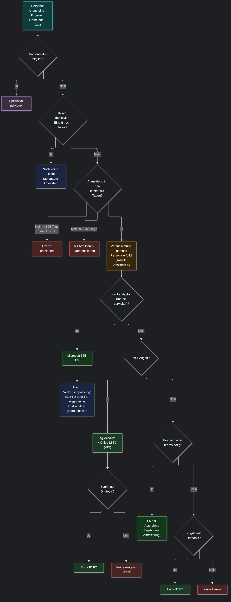
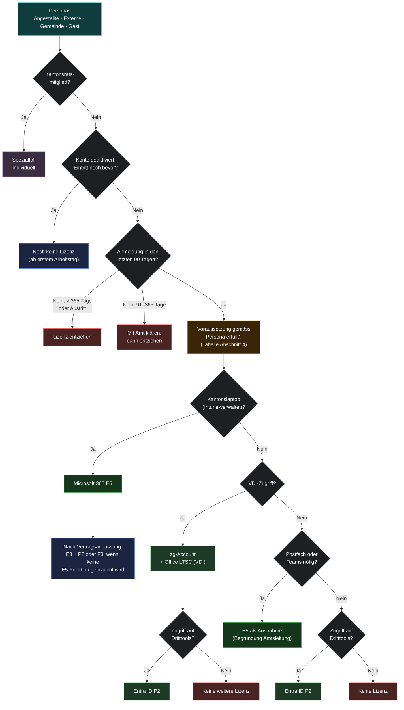

# Lizenzmatrix v2

**Ziel:** Weniger Microsoft-365-E5-Lizenzen. E5 nur für Personen, die einen Kantonslaptop haben oder
E5-Funktionen wirklich brauchen. Wer nur Zugriff auf Dritttools braucht, bekommt Entra ID P2.
Lizenzen, die nicht genutzt werden, werden nach festen Regeln entzogen.

Stand: Oktober 2026. Basiert auf der Lizenzauswertung vom 06.10.2026 (`scripts/Get-LizenzReport.ps1`).

---

## 1. Was an der Matrix v1 das Problem war

| # | Problem in v1 | Folge |
|---|---|---|
| 1 | **Angestellte bekommen immer E5**, ohne Prüfung | Auch Personen ohne Kantonslaptop oder ohne Nutzung belegen E5. |
| 2 | **„Kantonslaptop = Ja“ führt bei Externen, Gemeinde und Gästen direkt zu E5** | Externe und Projektmitarbeitende bekommen die teuerste Lizenz, nur weil sie ein Gerät haben. |
| 3 | **Keine Regel zum Entziehen** | Inaktive und ausgetretene Konten behalten E5, solange sie in der Gruppe sind. Die Auswertung fand 165 solche Konten (5,5 % aller E5). |
| 4 | **Lizenz ab Kontoerstellung** | Vorbereitete Eintritte (Konto deaktiviert bis zum Starttermin) belegen wochenlang eine E5. |
| 5 | **Vier Bäume** für dieselbe Frage | Schwer zu pflegen, schwer zu automatisieren. |
| 6 | **Doppellizenzen werden nicht verhindert** | E5 enthält schon Entra ID P1/P2 und Power BI Pro. Werden diese zusätzlich zugewiesen, zahlt man doppelt. |

---

## 2. Rahmenbedingungen, die die Matrix bestimmen

**Entra ID P2 ersetzt E5 nicht 1:1.** P2 lizenziert nur die *Identität* (Anmeldung, Conditional Access,
Identity Protection, PIM, Zugriff auf Enterprise Applications / Dritttools). P2 enthält **nicht**:
Exchange-Postfach, Teams, OneDrive, SharePoint, Office-Apps, Intune, Windows Enterprise, Defender for Endpoint.

**Im Vertrag gibt es heute nur E5 und P2**, kein Microsoft 365 E3 und kein F3. Daraus folgt:

| Situation | Heute möglich | Nach Vertragsanpassung zusätzlich |
|---|---|---|
| Kantonslaptop (Intune, Office, Postfach) | **E5** | E3 + P2 (voller Arbeitsplatz ohne E5-Extras), F3 (Werkhof, Schalter) |
| Kein Laptop, VDI | zg-Account + Office LTSC, dazu **P2** bei Dritttools | – |
| Kein Laptop, keine VDI, nur Dritttools | **P2** | – |
| Kein Laptop, aber Postfach/Teams nötig | E5 als begründete Ausnahme | F3 oder Exchange Online Plan 1 |
| Nichts davon | **Keine Lizenz** | – |

Das Sparpotenzial liegt deshalb heute in drei Blöcken, in dieser Reihenfolge:

1. **Inaktive und ausgetretene Konten**: Lizenz entziehen (Abschnitt 5).
2. **Personen ohne Kantonslaptop mit E5**: auf P2 oder keine Lizenz umstellen (braucht die Nutzungsberichte).
3. **Doppellizenzen und ungenutzte Zusatzprodukte** (Power BI Pro, Windows VDA): beim nächsten True-up kündigen.

Ein vierter Block, Laptop-Benutzer ohne E5-Bedarf auf E3/F3, wird erst mit einer Vertragsanpassung möglich.

> ⚠️ **Beim Entziehen von E5** verschwinden auch Postfach und OneDrive. Das Postfach wird nach 30 Tagen gelöscht,
> OneDrive nach Ablauf der Aufbewahrungsfrist. Vor dem Entzug prüfen, ob die Daten noch gebraucht werden;
> ggf. das Postfach in ein freigegebenes Postfach umwandeln (kostenlos, Mails bleiben erhalten).

---

## 3. Die Matrix: eine Logik für alle Personas



Statt vier Bäumen gibt es **einen Entscheidungsbaum**. Die Persona entscheidet nur noch über die
**Voraussetzungen** (Abschnitt 4), nicht mehr über die Lizenz. Kantonsratsmitglieder bleiben Spezialfälle,
die individuell behandelt werden.



Das Diagramm lässt sich in draw.io übernehmen: *Anordnen → Einfügen → Erweitert → Mermaid*, Code einfügen.

---

## 4. Voraussetzungen pro Persona

| Persona | Voraussetzung | Ohne Laptop | Mit Laptop | Bemerkung |
|---|---|---|---|---|
| **Angestellte Kanton Zug** | AD-Konto (intern), EmployeeType gepflegt | P2 (Dritttools) oder keine Lizenz | E5 | Aushilfen, Praktikanten, Auszubildende nur mit Laptop E5 |
| **Externe auf Mandatsebene** | zg-Account; bei Laptop: vollständig integriertes AD-Konto (GPOs) | VDI: zg-Account + LTSC, dazu P2 bei Dritttools | E5 | E5 nur mit begründetem Antrag der Amtsleitung |
| **Gemeindemitarbeitende** | Über GDS synchronisiert (sonst keine Lizenz); Dritttools über Enterprise Application in Entra ID | P2 | E5 (Ausnahme) | Standard ist P2 |
| **Gastaccount (Projektmitarbeitende)** | zg-Account, **befristet** (Ablaufdatum Pflicht) | P2 | E5 (Ausnahme) | Nach Ablauf: Konto deaktivieren, Lizenz entfällt automatisch |
| **Kantonsratsmitglieder** | – | Spezialfall, individuell | Spezialfall, individuell | 90-Tage-Regel gilt trotzdem |

**E5-Funktionen**, die bei einem späteren E3/F3-Angebot eine E5 rechtfertigen (bis dahin nicht relevant):
Teams-Telefonie mit eigener Nummer, Power BI Pro, Purview Premium (eDiscovery, Insider Risk), Defender P2
für exponierte Rollen.

---

## 5. Betriebsregeln

1. **90-Tage-Regel.** Ein lizenziertes Konto ohne Anmeldung (interaktiv oder im Hintergrund) seit
   - **mehr als 365 Tagen** oder **deaktiviert (Austritt)**: Lizenz wird entzogen, ohne Rückfrage.
   - **91 bis 365 Tagen** oder **nie angemeldet bei Konto älter als 90 Tage**: Amt wird informiert, Frist 14 Tage, dann Entzug.

   Ausnahmen (kein Entzug): vorbereitete Eintritte (Konto deaktiviert, jünger als 60 Tage, nie angemeldet);
   gemeldete Langzeitabwesenheiten (Mutterschaft, Krankheit, Sabbatical), die auf einer Ausnahmeliste stehen.

2. **Lizenz erst ab erstem Arbeitstag.** Lizenzgruppen verlangen `accountEnabled = true`.
   Vorbereitete, noch deaktivierte Konten bekommen keine Lizenz.

3. **Gruppenbasierte Lizenzierung, keine direkten Zuweisungen.** Heute laufen 3'006 von 3'025 E5 über Gruppen,
   5 direkt und 14 gemischt. Die direkten werden bereinigt. Vorschlag für die Gruppenstruktur:

   | Gruppe | Lizenz | Mitgliedschaft (dynamische Regel, Beispiel) |
   |---|---|---|
   | `LIC-M365-E5` | Microsoft 365 E5 | `(user.accountEnabled -eq true) -and (user.<LaptopAttribut> -eq "Ja") -and (user.employeeType -ne "Kantonsrat")` |
   | `LIC-M365-E5-AUSNAHME` | Microsoft 365 E5 | manuell, nur mit Antrag und Begründung, jährlicher Access Review |
   | `LIC-ENTRA-P2` | Entra ID P2 | `(user.accountEnabled -eq true) -and (user.<LaptopAttribut> -ne "Ja") -and (user.<DritttoolAttribut> -eq "Ja")` |
   | `LIC-KANTONSRAT` | individuell | manuell, Staatskanzlei |

   `<LaptopAttribut>` und `<DritttoolAttribut>` sind AD-Attribute (z. B. `extensionAttribute10/11`), die im
   Onboarding gesetzt werden. Welche ihr nehmt, hängt davon ab, was heute schon gepflegt wird.

4. **E5 nur auf Antrag** für alle, die nicht über die Standardregel E5 bekommen. Die Ausnahmegruppe wird
   jährlich per Entra Access Review (in P2 enthalten) überprüft.

5. **Keine Doppellizenzen.** Wer E5 hat, bekommt kein zusätzliches P1/P2 und kein Power BI Pro.
   Der Report meldet Verstösse.

6. **Gäste und befristete Konten immer mit Ablaufdatum.** Nach Ablauf wird das Konto deaktiviert, die
   Lizenz fällt durch Regel 2 automatisch weg.

7. **Quartalsweise Report** mit `scripts/Get-LizenzReport.ps1`. Die Spalten *Anmeldestatus* und *Empfehlung*
   werden abgearbeitet. Voraussetzung: Rolle Security Administrator (Anmeldedaten) und Reports Reader
   (Nutzungsdaten), vorher in PIM aktivieren.

---

## 6. Vorgehen Umstellung

| Schritt | Was | Wer |
|---|---|---|
| 1 | Sofort-Entzug: Austritte und Konten ohne Anmeldung seit > 365 Tagen | AIO |
| 2 | Liste der übrigen Kandidaten pro Amt verschicken, Frist 14 Tage, dann Entzug | AIO, Ämter |
| 3 | Regel für Kantonsratsmitglieder festlegen (viele inaktive E5) | Staatskanzlei |
| 4 | Reports Reader und Admin Consent für `Reports.Read.All` beschaffen, Block 2 auswerten (E5 ohne Nutzung → P2) | Identity-Team, AIO |
| 5 | Laptop-/Dritttool-Attribut im AD definieren und im Onboarding pflegen | AIO, HR |
| 6 | Lizenzgruppen gemäss Abschnitt 5 anlegen, `accountEnabled`-Bedingung ergänzen, direkte Zuweisungen bereinigen | AIO |
| 7 | Pilot mit einer Persona (z. B. Externe ohne Laptop) | AIO |
| 8 | True-up: E5-Anzahl senken, P2 erhöhen, Power BI Pro / Windows VDA prüfen, E3/F3 anfragen | Lizenzverantwortliche |

### Kostenrechnung

| Lizenz | Preis / Monat (Vertrag) | Anzahl heute | Anzahl Ziel | Kosten heute / Jahr | Kosten Ziel / Jahr |
|---|---:|---:|---:|---:|---:|
| Microsoft 365 E5 | | 3'025 | | | |
| Entra ID P2 | | 10 | | | |
| **Total** | | | | | |

---

## 7. Nützliche Befehle

Der Report braucht keine Module (siehe README). Für Einzelabfragen und Änderungen eignet sich das
Microsoft-Graph-Modul, sobald der Admin Consent dafür vorliegt:

```powershell
Connect-MgGraph -Scopes "User.Read.All","Directory.Read.All","AuditLog.Read.All","Group.ReadWrite.All"

# Lizenzbestand: gekauft vs. zugewiesen
Get-MgSubscribedSku | Select-Object SkuPartNumber, ConsumedUnits, @{n='Gekauft';e={$_.PrepaidUnits.Enabled}}

# Letzte Anmeldung einer Person
Get-MgUser -UserId 'max.muster@zg.ch' -Property signInActivity | Select-Object -ExpandProperty SignInActivity

# Deaktivierte Konten, die noch eine Lizenz haben
Get-MgUser -All -Filter "accountEnabled eq false and assignedLicenses/`$count ne 0" -ConsistencyLevel eventual -CountVariable n |
    Select-Object DisplayName, UserPrincipalName

# Person aus einer Lizenzgruppe entfernen (so wird bei Gruppenlizenzierung entzogen)
$group = Get-MgGroup -Filter "displayName eq 'LIC-M365-E5'"
$user  = Get-MgUser -UserId 'max.muster@zg.ch'
Remove-MgGroupMemberByRef -GroupId $group.Id -DirectoryObjectId $user.Id
```
